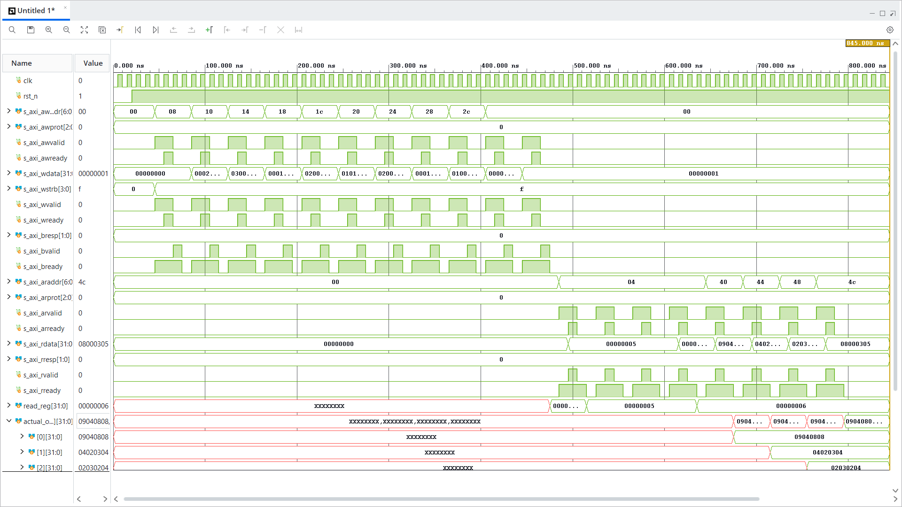
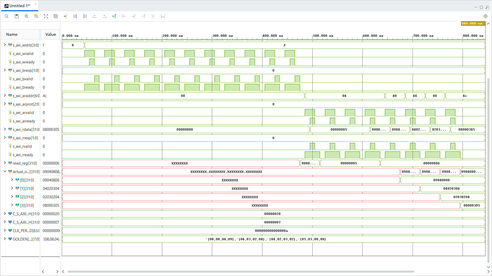

# Parameterized 2D Systolic Tensor Core in Verilog

A scalable, autonomous 2D Systolic Array matrix-matrix multiplication (GEMM) accelerator designed in synthesizable Verilog for FPGA neural network inferencing.

---

## Architectural Highlights

* **Precision:** INT8 signed operands (activations and weights), 32-bit signed internal accumulation, and quantized INT8 activation outputs.
* **Scalable 2D Mesh:** Parameterized systolic array ($N \times N$) instantiated using Verilog modular interconnects.
* **Wavefront Synchronization:** Hardware input skew buffers align parallel matrix streams automatically into the diagonal processing wavefront.
* **2D Output Deskew Network:** Staggered output completion delays are realigned using coordinate-based shift registers $(3-i) + (3-j)$, presenting all 16 results simultaneously.
* **Fused Quantization & Activation:** Integrated post-processing unit providing parameterizable arithmetic right-shift scaling (`SCALE_SHIFT`), saturation clamping ($[-128, +127]$), and zero-overhead fused ReLU.
* **Autonomous Timing Controller:** Moore FSM coordinating zero-clearing, runtime execution, and valid strobing across the precise compute and deskew latency window.
* **Output Stationary:** Intermediate results accumulate locally within each Processing Element to minimize interconnect routing congestion.

---

## Dataflow Architecture

The tensor core executes a synchronized 2D output-stationary matrix multiplication ($C = A \times B$):

* **Matrix B (Weights - North Inputs):** Streams vertically into column ports `b0_raw` through `b3_raw`. The input skew buffer introduces a progressive delay of $k$ cycles to Column $k$, staggering the weights to meet the compute wavefront.
* **Matrix A (Activations - West Inputs):** Streams horizontally into row ports `a0_raw` through `a3_raw`. The input skew buffer introduces a progressive delay of $k$ cycles to Row $k$, ensuring activations align spatially with corresponding weights.
* **Processing Element (PE) Mesh:** A 2D array of 16 PEs where each unit contains an INT8 MAC engine. Activations flow East, weights flow South, and partial products accumulate in local 32-bit stationary registers.
* **2D Deskew & Quantization:** Completed accumulators pass through a 2D deskew delay pipeline to align completion times across diagonals. The aligned 32-bit sums are scaled, clamped to 8-bit signed range, and activated via ReLU.
* **Wavefront Alignment:** Full matrix execution and deskew settling finish synchronously, after which `valid_out` pulses high to signal that all 16 INT8 outputs hold final valid activations.

---

## Module Breakdown

| Module | Location | Description |
| :--- | :--- | :--- |
| `processing_element.v` | `rtl/` | Core MAC unit containing signed multiplier, accumulator, and East/South forwarding pipeline registers |
| `systolic_array_4x4.v` | `rtl/` | 2D PE grid with nearest-neighbor spatial interconnects |
| `input_skew_buffer_4x4.v` | `rtl/` | Shift-register delay network delaying row/column index $k$ by $k$ clock cycles |
| `systolic_deskew_2d_4x4.v` | `rtl/` | Inverted coordinate shift-register network aligning diagonal output completion times |
| `quantizer_unit.v` | `rtl/` | Single-channel arithmetic right-shift, saturation clamp ($[-128, +127]$), and fused ReLU |
| `quantizer_4x4.v` | `rtl/` | Parallel 16-channel quantization wrapper converting deskewed sums to INT8 |
| `systolic_controller_4x4.v` | `rtl/` | Moore FSM controlling synchronous clears, compute enable, and `valid_out` timing |
| `systolic_tensor_core_4x4.v` | `rtl/` | Top-level integrated wrapper exposing unskewed parallel streaming interfaces |
| `tb_systolic_tensor_core_4x4.v` | `tb/` | Behavioral testbench verifying full $4 \times 4$ matrix multiplication against Identity matrices |

---

## Timing & Wavefront Rule

For an $N \times N$ matrix multiplication, data propagates through the grid along diagonal wavefronts:
* **Wavefront Propagation:** Inputs are skewed by index delay ($i, j$).
* **Output Realignment:** Deskew stages insert $(2N - 2) - (i + j)$ cycles of compensation delay.
* **FSM Latency Sequence:**
  1. `S_IDLE`: Awaiting start strobe.
  2. `S_CLEAR`: 1 cycle synchronous accumulator zeroing.
  3. `S_COMPUTE`: Active pipelined matrix MAC operations and wavefront deskewing.
  4. `S_DONE`: 1 cycle single-pulse `valid_out` strobe upon complete parallel settling.

---

## Simulation & Waveform Verification

Verified using **AMD Vivado Simulator (XSim)**.

### 1. Control Handshake & Input Skewing
The controller responds to `start`, clears internal state, and streams matrix inputs into diagonal wavefronts:

### 2. Output Deskewing & Valid INT8 Output ($A \times I_4 = A$)
* **Input A:** 4x4 matrix streaming parallel rows cycle-by-cycle.
* **Input B:** 4x4 identity matrix ($I_4$).
* **Result:** Output lines `c00` through `c33` settle simultaneously on `valid_out = 1`, producing matrix $A$ in signed INT8 precision with zero overflow or transposition errors.

---

### Hardware Synthesis & Implementation (AMD Artix-7)

Synthesized using AMD Vivado for the **XC7A100T-CSG324-1** FPGA target:
* **Target Frequency:** 100 MHz (10.0 ns period)
* **Worst Negative Slack (WNS):** +2.391 ns (Met, 0 failing endpoints)
* **Maximum Operating Frequency ($F_{\max}$):** 131.42 MHz
* **Logic Utilization:** 2,516 LUTs (3.97%), 1,902 FFs (1.50%)
* **Shift Register Memory:** 320 SRL16E primitives inferred for skew/deskew networks
* **Internal Precision:** 32-bit internal accumulation mapped with 448 fast CARRY4 chains
