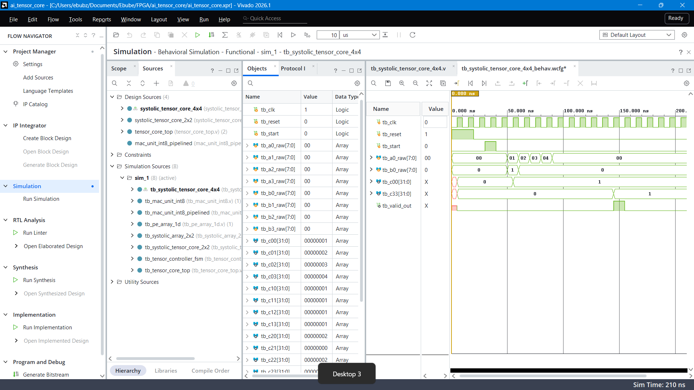

# Parameterized 2D Systolic Tensor Core in Verilog

A scalable, autonomous 2D Systolic Array matrix-matrix multiplication (GEMM) accelerator designed in synthesizable Verilog for FPGA neural network inferencing.

---

## Architectural Highlights

* **Precision:** INT8 signed operands (activations and weights) with 32-bit signed accumulation registers per PE.
* **Scalable 2D Mesh:** Parameterized systolic array ($N \times N$) instantiated using Verilog nested `generate` blocks.
* **Wavefront Synchronization:** Hardware input skew buffers align parallel matrix streams automatically into the diagonal processing wavefront.
* **Autonomous Timing Controller:** Moore FSM coordinating zero-clearing, runtime execution, and valid strobing across the precise $3N - 2$ cycle compute window.
* **Output Stationary:** Intermediate results accumulate locally within each Processing Element to minimize interconnect routing congestion.

---

## Dataflow Architecture

The tensor core executes a synchronized 2D output-stationary matrix multiplication ($C = A \times B$):

* **Matrix B (Weights - North Inputs):** Streams vertically into column ports `b0_raw` through `b3_raw`. The input skew buffer introduces a progressive delay of $k$ cycles to Column $k$, staggering the weights to meet the compute wavefront.
* **Matrix A (Activations - West Inputs):** Streams horizontally into row ports `a0_raw` through `a3_raw`. The input skew buffer introduces a progressive delay of $k$ cycles to Row $k$, ensuring activations align spatially with corresponding weights.
* **Processing Element (PE) Mesh:** A 2D array of 16 PEs where each unit contains an INT8 MAC engine. Activations flow East, weights flow South, and partial products accumulate in local 32-bit stationary registers.
* **Wavefront Alignment:** Full matrix execution finishes in $3N - 2 = 10\text{ cycles}$ for a $4 \times 4$ array, after which `valid_out` pulses high to signal that all 16 accumulators hold settled results.

---

## Module Breakdown

| Module | Location | Description |
| :--- | :--- | :--- |
| `systolic_pe.v` | `sources_1/new/` | Core MAC unit containing signed multiplier, accumulator, and East/South forwarding pipeline registers |
| `systolic_array_4x4.v` | `sources_1/new/` | Parameterized 2D PE grid with nearest-neighbor spatial interconnects |
| `input_skew_buffer_4x4.v` | `sources_1/new/` | Shift-register delay network delaying row/column index $k$ by $k$ clock cycles |
| `systolic_controller_4x4.v` | `sources_1/new/` | 4-state Moore FSM controlling synchronous clears and $3N-2$ counter |
| `systolic_tensor_core_4x4.v` | `sources_1/new/` | Top-level integrated wrapper exposing unskewed parallel streaming interfaces |
| `tb_systolic_tensor_core_4x4.v` | `sim_1/new/` | Behavioral testbench verifying full $4 \times 4$ matrix multiplication against Identity matrices |

---

## Timing & Wavefront Rule

For an $N \times N$ matrix multiplication, data propagates through the grid along diagonal wavefronts:
* **Compute Window:** $3N - 2$ clock cycles (10 cycles for $N = 4$).
* **FSM Latency Sequence:**
  1. `S_IDLE`: Awaiting start strobe.
  2. `S_CLEAR`: 1 cycle synchronous accumulator zeroing.
  3. `S_COMPUTE`: $3N - 2$ cycles active matrix MAC operations.
  4. `S_DONE`: 1 cycle single-pulse `valid_out` strobe upon settling.

---

## Simulation & Waveform Verification

Verified using **AMD Vivado Simulator (XSim)**.

### Identity Matrix Test Case ($A \times I_4 = A$)
* **Input A:** 4x4 matrix streaming parallel columns cycle-by-cycle.
* **Input B:** 4x4 identity matrix ($I_4$).
* **Result:** Output accumulators $C_{00} \dots C_{33}$ reproduce matrix $A$ exactly upon assertion of `valid_out` with zero transpositions.
